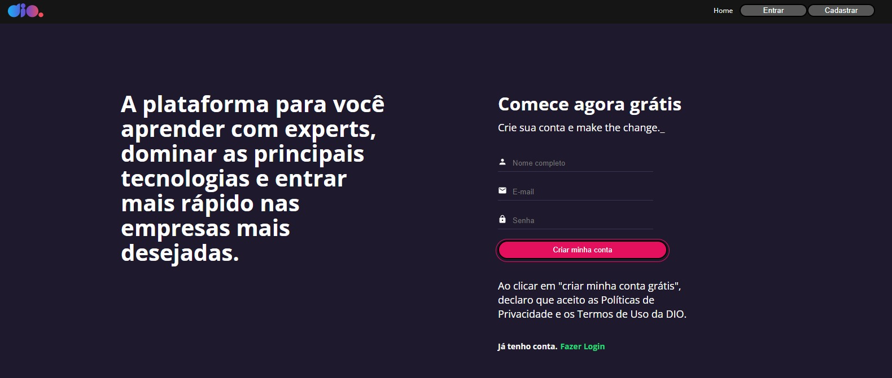

# Tela de cadastro Dio

Esse repositório é um desafio do Bootcamp ["Orange Tech +"](https://www.dio.me/bootcamp/orange-tech) da DIO. É um clone do site oficial da DIO e o desafio foi criar uma tela de cadastro para a aplicação. Foi criado a pagina (router) de Cadastro e além disso fiz com que o Header, antes não funcional, ficasse funcional com o react router dom.  

**Comandos:** 
1. "yarn" para baixar dependencias. 
2. "yarn run start" para iniciar a aplicação.

## Preview

